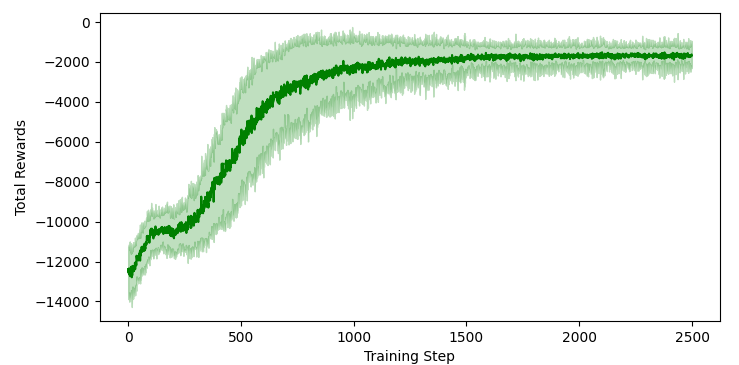
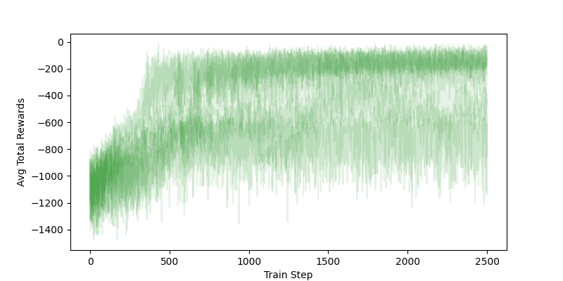

# JAX PPO

JAX (using [flax](https://flax.readthedocs.io/en/latest/)) Implementation of
Proximal Policy Optimisation (PPO) Algorithm, designed for continuous action spaces.

The base implementation is largely based around the
[cleanrl implementation](https://github.com/vwxyzjn/cleanrl/blob/master/cleanrl/ppo.py)
and the recurrent implementation using LSTM motivated by these blogs:

- https://npitsillos.github.io/blog/2021/recurrent-ppo/
- https://medium.com/@ngoodger_7766/proximal-policy-optimisation-in-pytorch-with-recurrent-models-edefb8a72180
- https://kam.al/blog/ppo_stale_states/

## Usage

See `example/gym_usage.ipynb` for an example of using this implementation
with a [gymnax](https://github.com/RobertTLange/gymnax) environment.

Dependencies can be installed with [poetry](https://python-poetry.org/) by running

```bash
poetry install
```

## Results

### [Pendulum-V1](https://github.com/RobertTLange/gymnax/blob/main/gymnax/environments/classic_control/pendulum.py)

#### MLP Policy Network

Total rewards per train step with parameters
(see [example/gym_usage.ipynb](examples/gym_usage.ipynb))

- `n-train`: 2,500
- `n-steps`: 2,048
- `n-train-epochs`: 2
- `mini-batch-size`: 256
- `n-test-steps`: 2,000
- `gamma`: 0.95
- `gae-lambda`: 0.9
- `entropy-coefficient`: 0.0001
- `adam-eps`: 1e-8
- `clip-coefficient`: 0.2
- `critic-coefficient`: 0.5
- `max-grad-norm`: 0.75
- `LR`: 2e-3 &rarr; 2e-5



Mean and std of total rewards during training, averaged over random seeds.

#### Recurrent (LSTM) Policy Network

This was tested against the pendulum environment with the velocity
component of the observation masked.

Total rewards per train step with parameters
(see [example/lstm_usage.ipynb](examples/lstm_usage.ipynb))

- `n-train`: 2,500
- `n-train-env`: 32
- `n-test-env`: 5
- `n-train-epochs`: 2
- `mini-batch-size`: 512
- `n-test-steps`: 2,000
- `sequence-length`: 8
- `n-burn-in`: 8
- `gamma`: 0.95
- `gae-lambda`: 0.99
- `entropy-coefficient`: 0.0001
- `adam-eps`: 1e-8
- `clip-coefficient`: 0.1
- `critic-coefficient`: 0.5
- `max-grad-norm`: 0.75
- `LR`: 2e-3 &rarr; 2e-6

> **_NOTE:_**  This achieves good results but seems to be somewhat unstable. I
> suspect this might be due to stale hidden states
> ([see here](https://kam.al/blog/ppo_stale_states/))



Avg total rewards during training across test environments, generated from
10 random seeds.

## Implementation Notes

### Recurrent Hidden States Initialisation

At the start of each episode we reset the LSTM hidden-states to zero, but then
*burn-in* their value before we collect trajectories (and the same during evaluation).
I did also try carrying over hidden states between training steps, with good results,
but if training across multiple environments this becomes a bit harder to reason about.

Note that this may lead to strange behaviour is the training environment quickly
reaches a terminal state (i.e. if the episode completes during the burn-in period).

## TODO

- Early stopping based on the KL-divergence is not implemented.
- Benchmark against other reference implementations.
- Recalculate advantages during policy update.
- Recalculate hidden states during policy update.

## Developer Notes

### Pre-Commit Hooks

Pre commit hooks can be installed by running

```bash
pre-commit install
```

Pre-commit checks can then be run using

```bash
task lint
```

### Tests

Tests can be run with

```bash
task test
```
